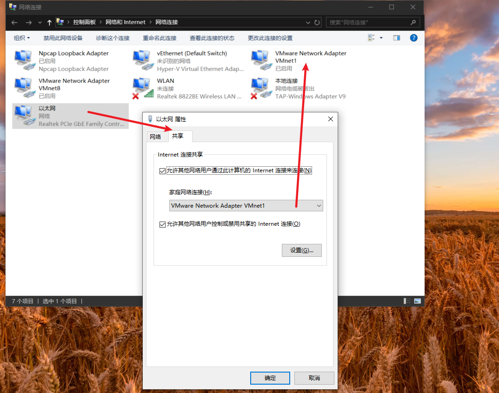

#====================什么是Host-Only模式？=================================================
Host-Only模式其实就是NAT模式去除了虚拟NAT设备，
然后使用VMware Network Adapter VMnet1虚拟网卡连接VMnet1虚拟交换机来与虚拟机通信的，其网络结构如下图所示：  

#====================如何设置Host-Only模式？===============================================
1.设置仅主机模式
> 注意：子网IP一定不能和宿主机相同，否则不能上网

2.设置虚拟操作系统为Host-Only模式。

#====================仅主机模式，怎么让虚拟机可以访问外网=======================================
可以如下设置：
>注意：
>Host-Only模式通过主机的虚拟网卡VMware Network Adapter VMnet1来连接虚拟交换机VMnet1,从而达到与虚拟机通信的目的，
>如果想在Host-only模式下联网，可以将能联网的主机网卡共享给VMware Network Adapter VMnet1，这样就可以实现虚拟机联网
>如下图：

#=====================VMnet1网络适配器的作用?=================================================
#如果禁用VMnet1：
- 宿主机不能ping通虚拟机
- 虚拟机也不能ping通主机

#如果启用VMnet1: 
- 宿主机可以ping通虚拟机
- 虚拟机也可以ping通宿主机
>>解释说明:
通过WireShark(输入过滤规则icmp)监听VMnet1，然后抓取[ping包]，
发现虚拟机ping宿主机机走的是VMnet1网络适配器
宿主机ping虚拟机也是走的VMnet1网络适配器

#如果把宿主机当前正在使用的网络适配器,共享给VMnet1:
- 虚拟机可以访问外网
- 虚拟机不能ping通宿主机
- 宿主机也不能ping通虚拟机
