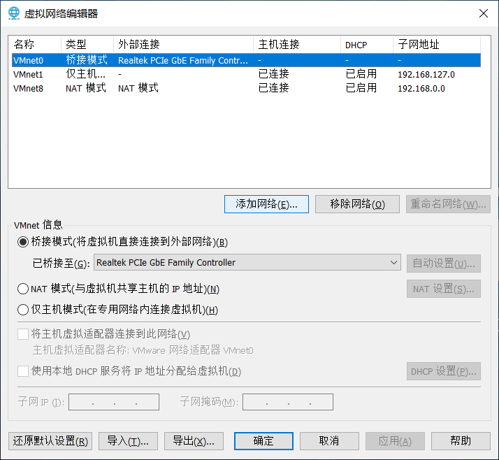
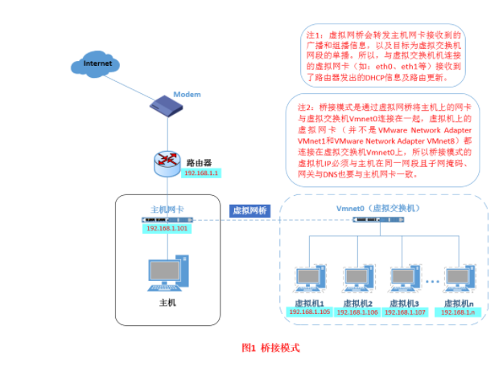
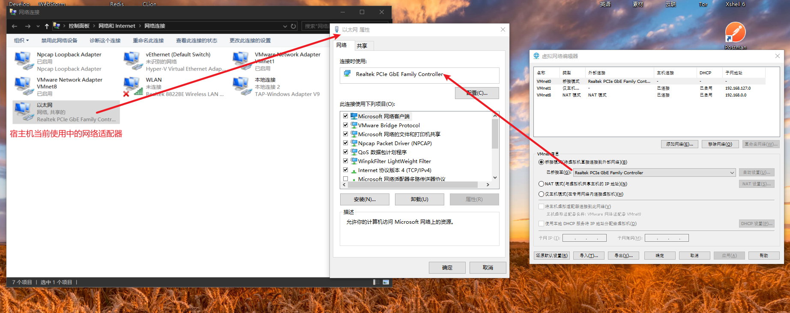
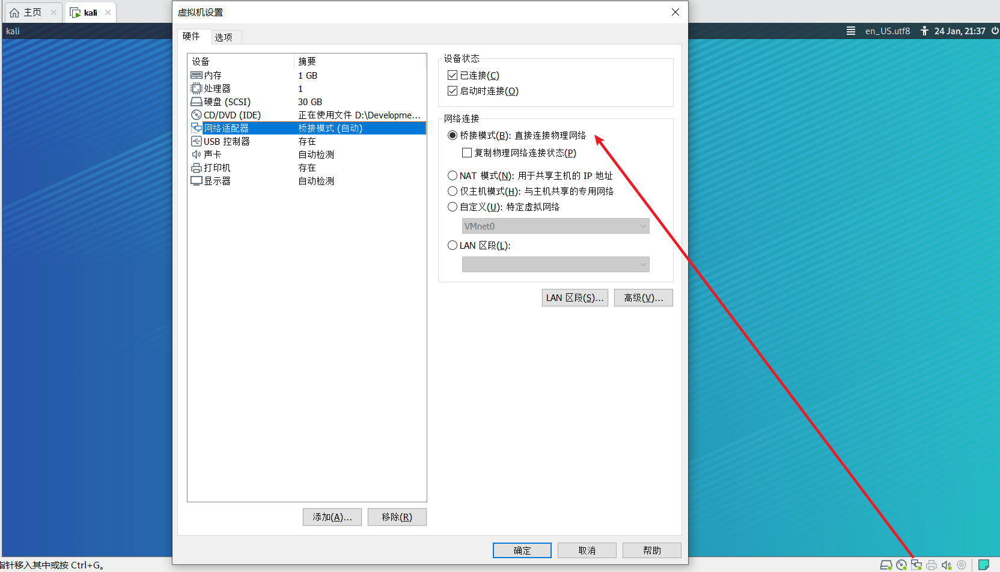
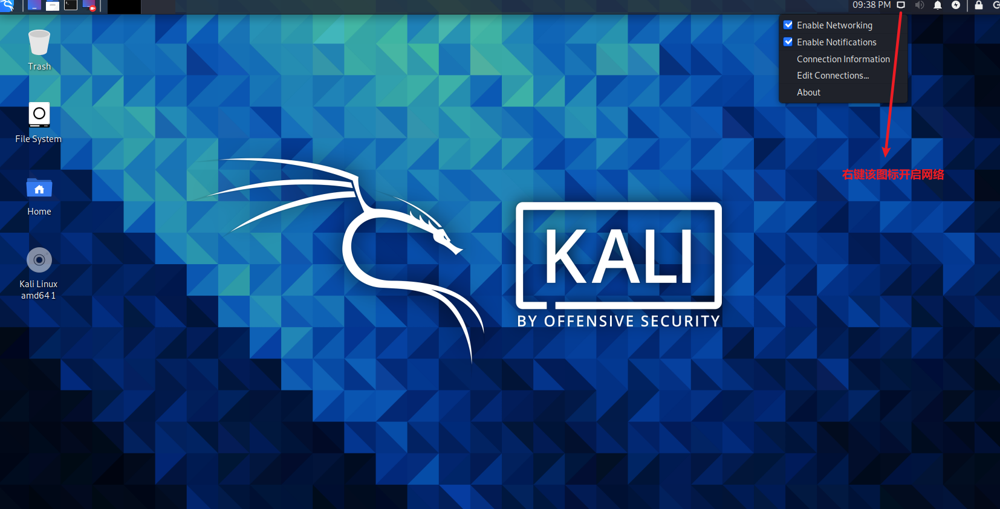

Vmware有三种网络模式：
- VMnet0（桥接模式）
- VMnet1（仅主机模式）
- VMnet8（NAT模式）  
  
同时，在主机上对应的有VMware Network Adapter VMnet1和VMware Network Adapter VMnet8两块虚拟网卡，
它们分别作用于仅主机模式与NAT模式下。在“网络连接”中我们可以看到这两块虚拟网卡，如果将这两块卸载了，
可以在VMware的“编辑”下的“虚拟网络编辑器”中点击“还原默认设置”，可重新将虚拟网卡还原。

小伙伴看到这里，肯定有疑问，为什么在真机上没有VMware Network Adapter VMnet0虚拟网卡呢？
那么接下来，我们就一起来看一下这是为什么。

一、Bridged（桥接模式-虚拟机ip和宿主机ip在同一网段）
什么是桥接模式？桥接模式就是将主机网卡与虚拟机虚拟的网卡利用虚拟网桥进行通信。在桥接的作用下，
类似于把物理主机虚拟为一个交换机，所有桥接设置的虚拟机连接到这个交换机的一个接口上，
物理主机也同样插在这个交换机当中，所以所有桥接下的网卡与网卡都是交换模式的，相互可以访问而不干扰。
在桥接模式下，虚拟机ip地址需要与主机在同一个网段，如果需要联网，则网关与DNS需要与主机网卡一致。其网络结构如下图所示：

#=====================================桥接模式的设置过程==============================================  
1.设置VMware的网络桥接到宿主机的设置

2.设置虚拟操作系统的网络为桥接模式(不勾选复制物理网络连接状态)
>勾选复制物理机网络连接状态的意思是：
当宿主机网络环境发生变化或切换时，虚拟机会向宿主机DHCP服务续订该虚拟机当前正在使用的IP地址

3.设置虚拟操作系统的网络开启

