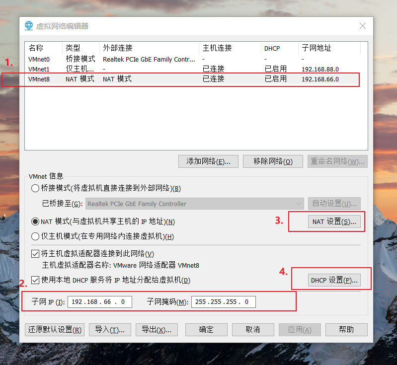
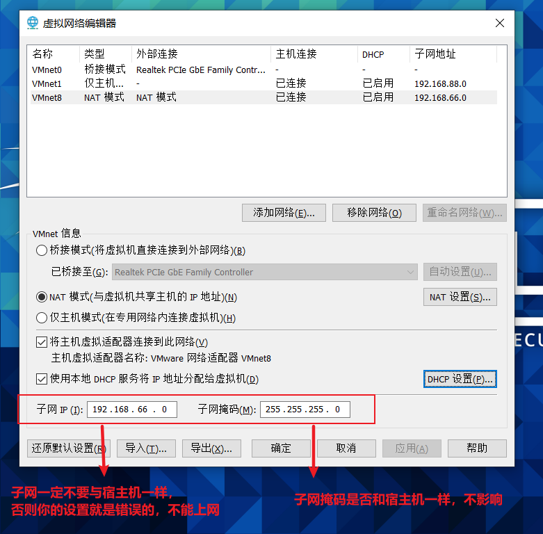

# 什么是NAT模式？
NAT模式借助虚拟NAT设备和虚拟DHCP服务器，使得虚拟机可以联网。其网络结构如下图所示：
  

在NAT模式中，主机网卡直接与虚拟NAT设备相连，然后虚拟NAT设备与虚拟DHCP服务器一起连接在虚拟交换机VMnet8上，这样就实现了虚拟机联网。
那么我们会觉得很奇怪，为什么需要虚拟网卡VMware Network Adapter VMnet8呢？
原来我们的VMware Network Adapter VMnet8虚拟网卡主要是为了实现主机与虚拟机之间的通信。

#===============================如何设置NAT模式？=============================================  
1.打开vmware，点击“编辑”下的“虚拟网络编辑器”，选中设置虚拟机中NAT模式的选项，设置NAT参数及DHCP参数
  

2.设置NAT模式的子网IP和子网掩码
> 注意：子网IP设置一定不要和宿主机一样，否则不能上网

3.点击NAT设置,设置网关 
> 注意：要和第二步的子网IP和子网掩码设置-相匹配
   

4.点击DHCP设置，设置起始ip和结束ip
> 注意：要和第二步的子网IP和子网掩码设置-相匹配
  

5.设置虚拟操作系统使用NAT模式
  

小结：
NAT模式，利用虚拟的NAT设备以及虚拟DHCP服务器来使虚拟机连接外网，
而VMware Network Adapter VMnet8虚拟网卡是用来与虚拟机通信的

#=========================NAT模式，虚拟操作系统怎么先经过宿主机之后，再上网==================================
>注意：VMware Network Adapter VMnet8的作用本质上是：虚拟操作系统和宿主机通讯的

>如果想让虚拟操作系统先经过宿主机，访问外部外网，那么进行如下设置：
