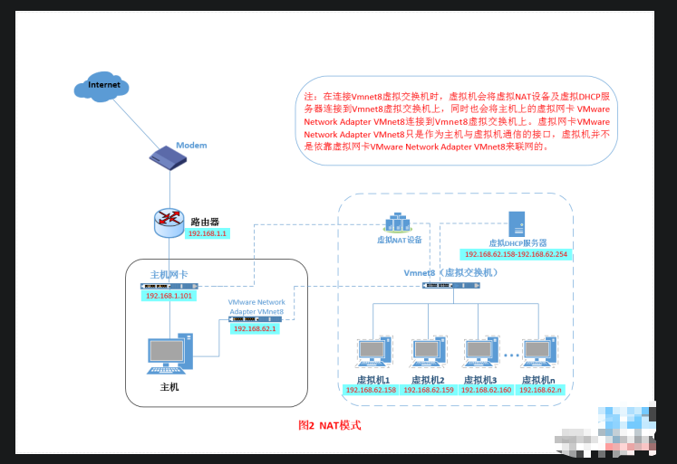
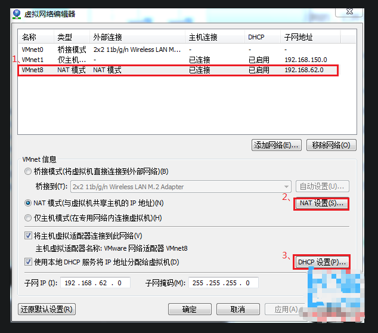
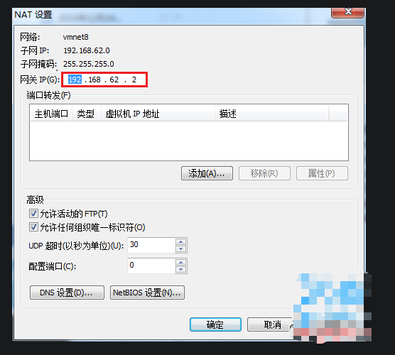
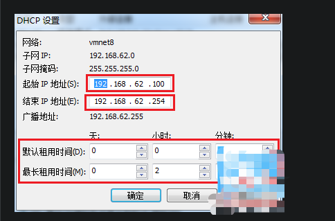
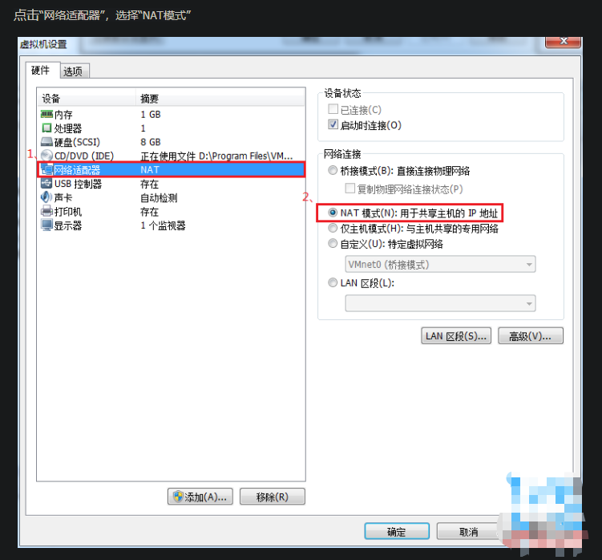
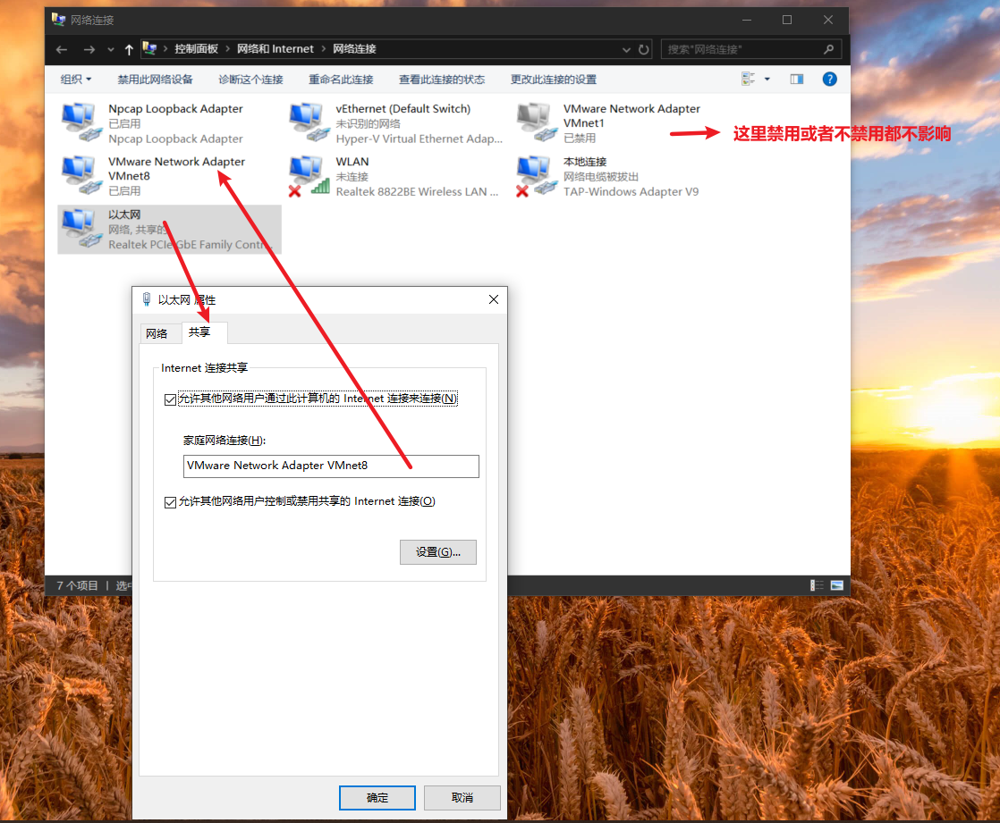

#1、什么是NAT模式？
NAT模式借助虚拟NAT设备和虚拟DHCP服务器，使得虚拟机可以联网。其网络结构如下图所示：
  

在NAT模式中，主机网卡直接与虚拟NAT设备相连，然后虚拟NAT设备与虚拟DHCP服务器一起连接在虚拟交换机VMnet8上，这样就实现了虚拟机联网。
那么我们会觉得很奇怪，为什么需要虚拟网卡VMware Network Adapter VMnet8呢？
原来我们的VMware Network Adapter VMnet8虚拟网卡主要是为了实现主机与虚拟机之间的通信。

#2、如何设置NAT模式。
1.设置虚拟机中NAT模式的选项，打开vmware，点击“编辑”下的“虚拟网络编辑器”，设置NAT参数及DHCP参数
  
  
  

2.设置虚拟操作系统使用NAT模式
  

# 最后有个疑问： 虚拟操作系统如果想访问外网，需要把宿主机的VMware8网络适配器禁用才行，目前不知道为什么?
# 而且宿主机的VMware1网络适配器 禁用或者启用 都不会影响到虚拟操作系统上网

如果不禁用VMware8的网络适配器，而且虚拟操作系统想访问外网，需要把宿主机网络，共享给VMware8网络适配器
如下图:

小结：
NAT模式，利用虚拟的NAT设备以及虚拟DHCP服务器来使虚拟机连接外网，
而VMware Network Adapter VMnet8虚拟网卡是用来与虚拟机通信的