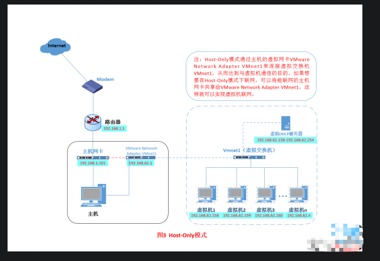
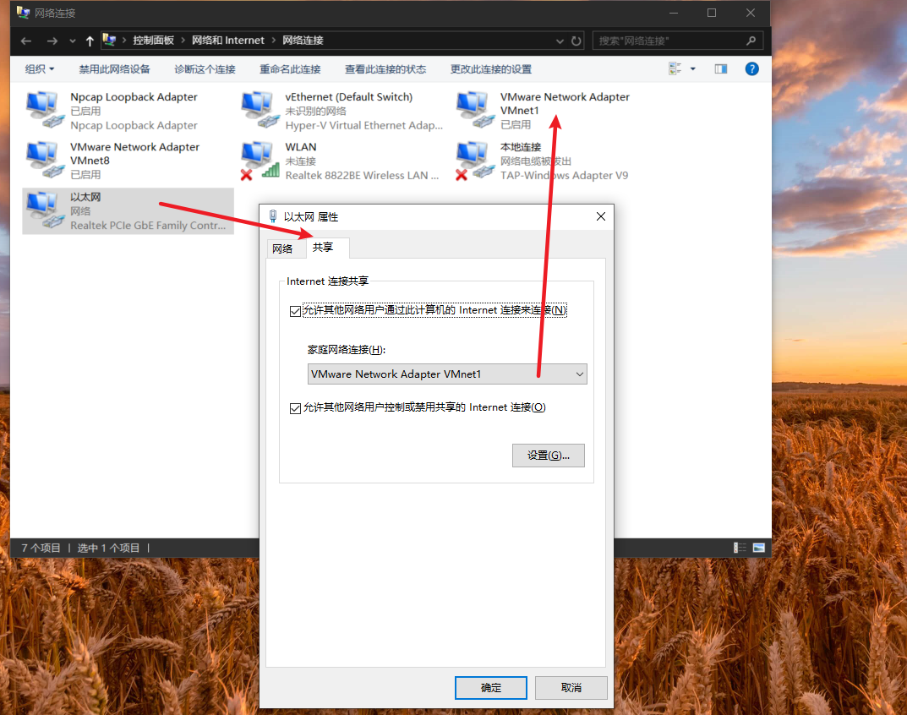
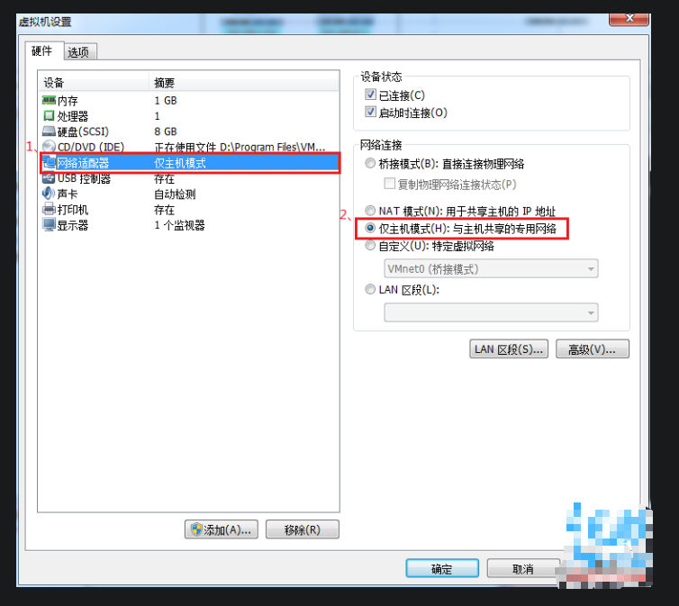

#1什么是Host-Only模式？

Host-Only模式其实就是NAT模式去除了虚拟NAT设备，
然后使用VMware Network Adapter VMnet1虚拟网卡连接VMnet1虚拟交换机来与虚拟机通信的，其网络结构如下图所示：

>注意：
>Host-Only模式通过主机的虚拟网卡VMware Network Adapter VMnet1来连接虚拟交换机VMnet1,从而达到与虚拟机通信的目的，
>如果想在Host-only模式下联网，可以将能联网的主机网卡共享给VMware Network Adapter VMnet1，这样就可以实现虚拟机联网
>如下图：

#2、如何设置Host-Only模式。
1.首先设置“虚拟网络编辑器”，可以设置DHCP的起始范围。

2.设置虚拟操作系统为Host-Only模式。

