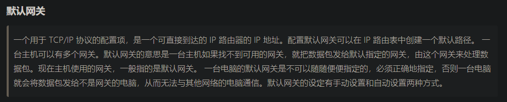
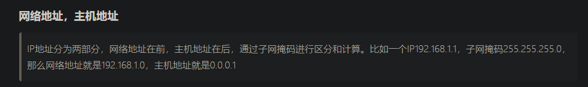
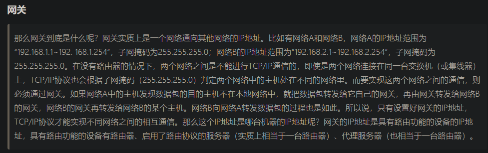
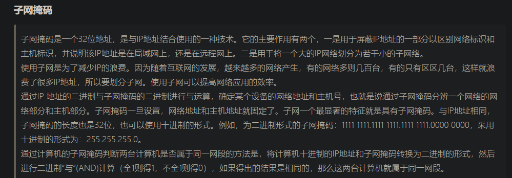
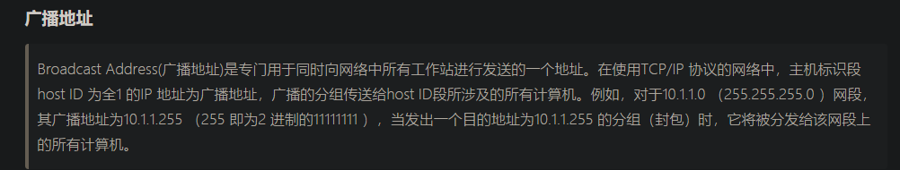
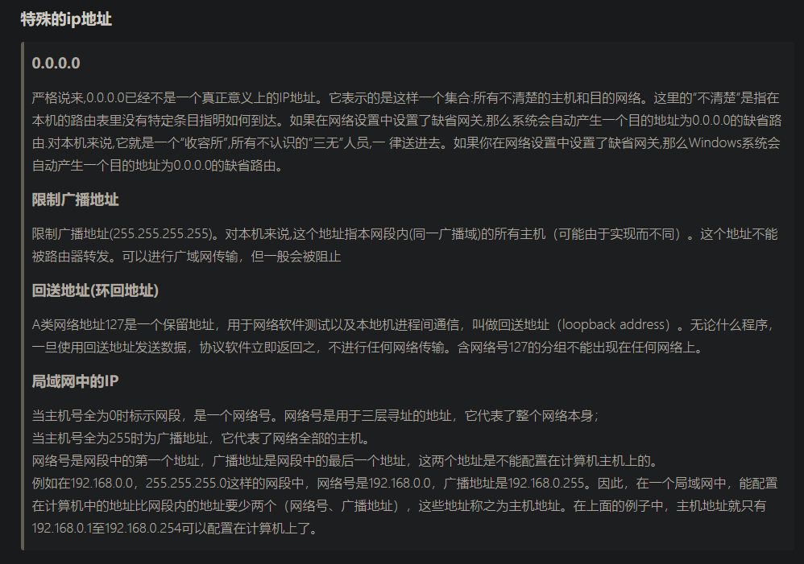

- 默认网关  


- 网络地址和主机地址  


- 网关（两个设备相互连接的中转站）


- 子网掩码  

```text
IP地址后面斜杠加具体数字详解
其实这种形式就是用CIDR（无类别域间路由选择，Classless and Subnet Address Extensions and Supernetting））的形式表示的一个网段，或者说子网。

我们知道确定一个子网需要知道主机地址和子网掩码，但用CIDR的形式，可以简单得到两个数值。举例说吧，192.168.0.0/24”就表示，这个网段的IP地址从192.168.0.1开始，到192.168.0.254结束（192.168.0.0和192.168.0.255有特殊含义，不能用作IP地址）；子网掩码是255.255.255.0。

上面的子网掩码怎么来的呢？其实关键就在“24”上。我们知道IP地址是四个十进制数组成的，相当于32位二进制。用CIDR表示形式，后一个数字将这32位进行了间隔（以24为例）：前24位用"1"表示，后面8位用0表示，得到一个二进制数：

11111111 11111111 11111111 00000000。将其转化为十进制，就是：255.255.255.0了。

例如：192.168.1.0/24表示网段是192.168.1.0，子网掩码是24位，子网掩码为：255.255.255.0，用二进制表示为：11111111 11111111 11111111 00000000 ，这里为什么是24呢，就是因为子网掩码里面的前面连续的“1”的个数为24个，一定要连续的才行。
```


- 广播地址（向当前网段中所有设备广播信息）  


- 特殊的IP地址  
