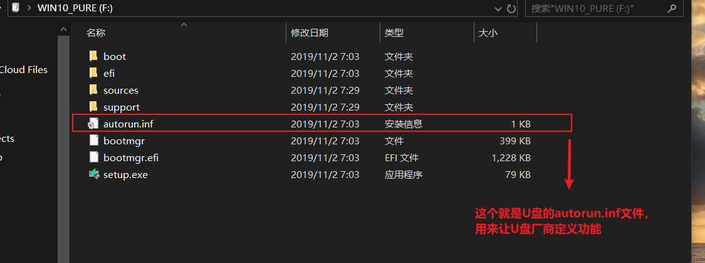
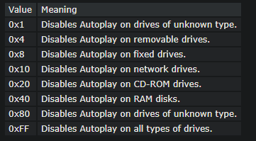

AutoRun是什么？Win10系统如何关闭AutoRun功能？

AutoRun是微软的windows系统的一种自动运行的文件命令，主要用于对于移动设施的自动运行。
一些用户反馈说电脑运行AutoRun功能，导致系统很卡，有什么方法可以关闭AutoRun功能？
其实关闭AutoRun功能方法简单，我们可以通过注册表来关闭。

AutoRun是什么？
AutoRun,正如其字面意思，自动运行，是微软的windows系统的一种自动运行的文件命令，主要用于对于移动设施的自动运行，
本是微软为了方便用户使用CDROM等移动设施而设置的程序，而现在却被很多病毒利用，
所以一旦用户发现来源不明的AutoRun.exe或者AutoRun.inf文件时一定要注意，要及时用杀毒软件查杀，避免因此遭受损失。

###################################Win10系统如何关闭AutoRun功能？############################################


#1.
“开始”菜单的“运行”中输入Regedit，打开注册表编辑器，展开到
HKEY_CURRENT_USER
    - Software
        - Microsoft
            - Windows
                - CurrentVersion 
                    - PoliciesExplorer
主键下，在右侧窗格中找到“NoDriveTypeAutoRun”，就是这个键决定了是否执行CDROM或硬盘的AutoRun功能；

#2.
点击 “NoDriveTypeAutoRun”，在默认状态下(即你没有禁止过AutoRun功能)，在弹出窗口中可以看到 “NoDriveTypeAutoRun”默认键值为95；
```text
十六进制：95
十进制： 149
二进制： 10010101
```

#3.
其中第一个值“91”是十六进制值，它是所有被禁止自动运行设备的和，将“91”转为二进制就是10010001，其中每位代表一个设备；


#########以下是微软官方对8个bit的每一个bit位作用的描述：###########
Description
Disables the Autoplay feature on all drives of the type specified.
Autoplay begins reading from a drive as soon as you insert media in the drive. As a result, 
the setup file of programs and the music on audio media starts immediately.
This entry stores the setting of the Disable Autoplay Group Policy. 
Group Policy adds this entry to the registry when you enable the Hide these specified drives in My Computer policy. 
If you disable the policy or set it to Not configured, 
Group Policy deletes the entry from the registry and the system behaves as though the value is 0x95.
This entry is a bitmapped value. To disable Autoplay on a particular type of drive, 
set the bit representing that drive type to 1. To disable more than one type of drive, 
set the bits representing each type to 1, or sum the hexadecimal values of the representative bits.  

  

By default, Autoplay is disabled on removable drives, such as the floppy disk drive (but not the CD-ROM drive), 
and on network drives. The default value 0x95 (149) is the sum of 0x1, 0x81 (unknown types), 0x4 (floppy drives), and 0x10 (network drives).

Change method
To change the value of this entry, use Group Policy. This entry corresponds to the Disable Autoplay policy (Computer Configuration\Administrative Templates\System).

Note Image Note

Autoplay is triggered by a Media Change Notification (MCN) message from the CD-ROM driver. 
If the Windows interface does not receive this message, Autoplay does not operate, 
regardless of the value of this entry. Entries that suppress the MCN message, 
such as Autorun and AutoRunAlwaysDisable also disable Autoplay.

Autoplay is also disabled on any drive 
if it is disabled by the value of NoDriveAutoRun (in HKLM or HKCU) or NoDriveTypeAutoRun (in HKLM or HKCU).
However, if NoDriveAutoRun or NoDriveTypeAutoRun appear in HKEY_LOCAL_MACHINE, 
their corresponding entries in HKEY_CURRENT_USER are ignored.

You can use the Disable Autoplay Group Policy to add CD-ROM drives to the list of drive types 
already disabled (removable drives, network drives, and unknown drives) or to disable Autoplay 
on all drives. You must edit the registry to set any other value.


```text
译文：
描述:在所有指定类型的驱动器上禁用自动播放功能。
当你在驱动器中插入媒体时，自动播放就开始读取驱动器。因此，程序的安装文件和音频媒体上的音乐立即开始。
此条目存储禁用自动播放组策略的设置。当您在“我的计算机策略”中启用“隐藏这些指定驱动器”时，组策略将此条目添加到注册表中。
如果禁用该策略或将其设置为Not configured，则Group policy将从注册表中删除该条目，系统的行为就像该值为0x95一样。
该条目是位映射值。若要在特定类型的驱动器上禁用自动播放功能，请将表示该驱动器类型的位设置为1。
若要禁用一种以上类型的驱动器，请将表示每种类型的位设置为1，或将代表位的十六进制值相加。

默认情况下，自动播放在可移动驱动器(如软盘驱动器(但不是CD-ROM驱动器))和网络驱动器上是禁用的。
默认值0x95(149)是0x1、0x81(未知类型)、0x4(软驱)、0x10(网络驱动器)的总和。

改变方法:
若要更改此项的值，请使用组策略。此条目对应于禁用自动播放策略(计算机配置管理模板系统)。
注意:
自动播放由来自CD-ROM驱动程序的媒体更改通知(MCN)消息触发。如果Windows界面没有接收到此消息，自动播放就不会运行，无论该条目的值是多少。
禁止MCN消息的表项，如Autorun和AutoRunAlwaysDisable也禁止自动播放。
若自动播放功能已被“NoDriveAutoRun”(HKLM或HKCU)或“NoDriveTypeAutoRun”(HKLM或HKCU)的值禁用，则自动播放功能亦会被禁用。
但是，如果“NoDriveAutoRun”或“NoDriveTypeAutoRun”出现在“HKEY_LOCAL_MACHINE”中，则会忽略它们在“HKEY_CURRENT_USER”中的对应条目。
您可以使用禁用自动播放组策略将CD-ROM驱动器添加到已经禁用的驱动器类型列表(可移动驱动器、网络驱动器和未知驱动器)或禁用所有驱动器的自动播放。
您必须编辑注册表以设置任何其他值。
```


