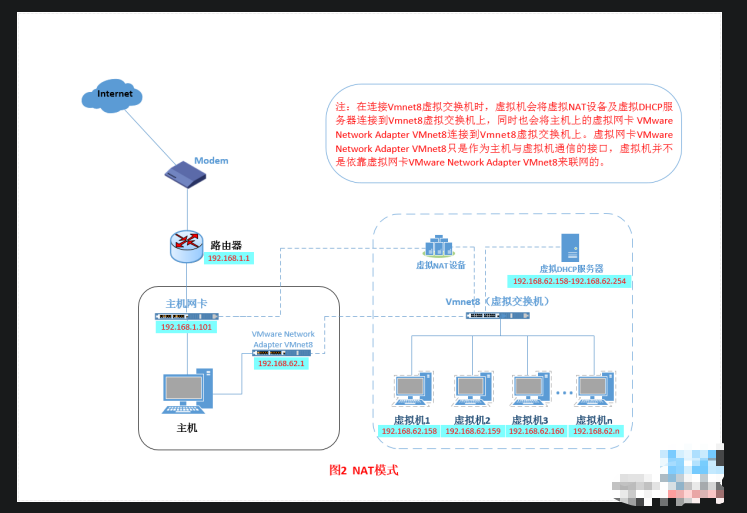
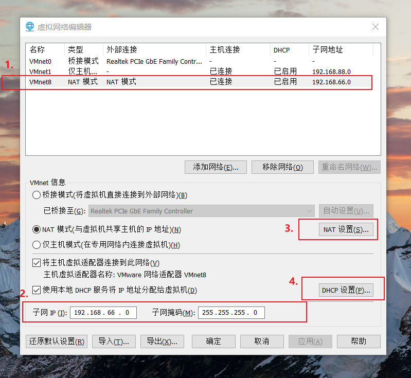
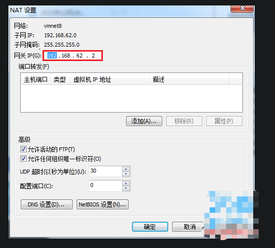
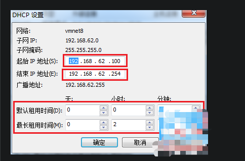
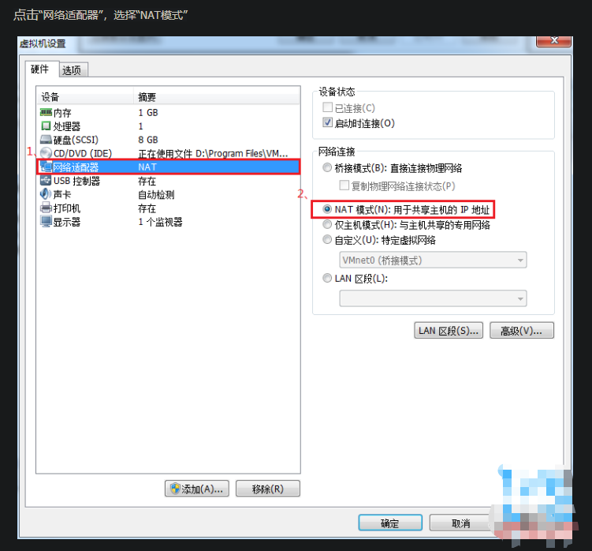
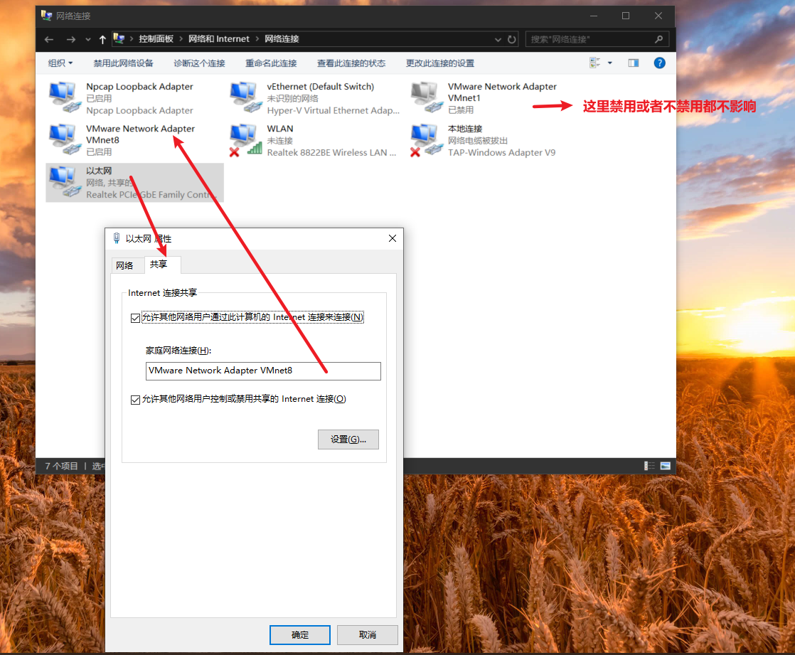

#============================什么是NAT模式？===============================================
NAT模式借助虚拟NAT设备和虚拟DHCP服务器，使得虚拟机可以联网。其网络结构如下图所示：
  

在NAT模式中，主机网卡直接与虚拟NAT设备相连，然后虚拟NAT设备与虚拟DHCP服务器一起连接在虚拟交换机VMnet8上，这样就实现了虚拟机连接外部网络。
那么我们会觉得很奇怪，为什么需要虚拟网卡VMware Network Adapter VMnet8呢？
原来我们的VMware Network Adapter VMnet8虚拟网卡主要是为了实现主机与虚拟机之间的通信。

#===============================如何设置NAT模式？=============================================  
1.打开vmware，点击“编辑”下的“虚拟网络编辑器”，选中设置虚拟机中NAT模式的选项，设置NAT参数及DHCP参数  
  

2.设置NAT模式的子网IP和子网掩码
> 注意：子网IP设置一定不要和宿主机一样，否则不能上网  

3.点击NAT设置,设置网关 
> 注意：要和第二步的子网IP和子网掩码设置-相匹配  
   

4.点击DHCP设置，设置起始ip和结束ip
> 注意：要和第二步的子网IP和子网掩码设置-相匹配  
  

5.设置虚拟操作系统使用NAT模式
    

小结：
NAT模式，利用虚拟的NAT设备以及虚拟DHCP服务器来使虚拟机连接外网，
而VMware Network Adapter VMnet8虚拟网卡是用来与虚拟机通信的

#==============================NAT模式的VMnet8到底有什么作用================================================================
#如果禁用VMnet8：
- 虚拟机可以上外网
- 宿主机不能Ping通虚拟机
- 虚拟机可以Ping通主机
通过WireShark监听[宿主机正在使用的网卡，并输入过滤规则icmp]，然后抓取[ping包]，
发现宿主机ping虚拟机走的是[宿主机正在使用的网络适配器]，并且不能ping通虚拟机
发现虚拟机ping主机走的是[先切换wireshark监听此网卡,宿主机上的回环网络适配器(Adapter for loopback traffic capture)]

#如果启用VMnet8: 
- 虚拟机可以上外网
- 宿主机可以Ping通虚拟机
- 虚拟机也可以Ping通宿主机
>>解释说明：
通过WireShark监听VMnet8，然后抓取[ping包]，
发现虚拟机ping宿主机机走的是VMnet8网络适配器
宿主机ping虚拟机也是走的VMnet8网络适配器

#如果把宿主机当前正在使用的网络适配器,共享给VMnet8:

- 虚拟机可以上外网
- 宿主机不能Ping通虚拟机
- 虚拟机可以Ping通主机
>>解释说明：
通过WireShark监听VMnet8，然后抓取[ping包]，
发现虚拟机ping宿主机走的是VMnet8网络适配器
宿主机ping虚拟机,一直是超时的,不能ping通 【通过wireShark切换到宿主机当前网络适配器，发现是ping走的宿主机当前网络适配器】

